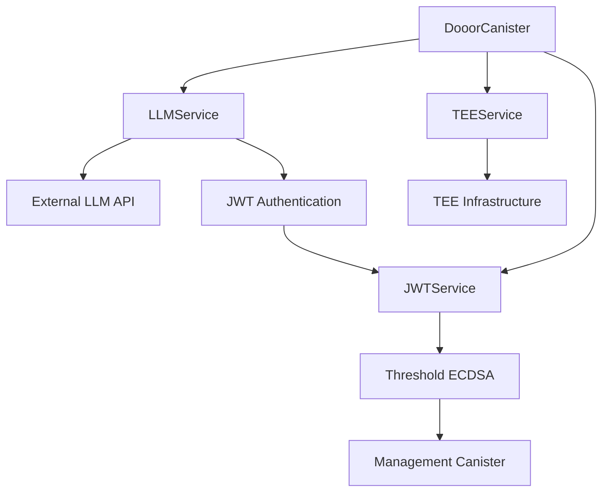

# Dooor ICP Canister
*DOOOR Team – August 2025*

A comprehensive Internet Computer Protocol (ICP) canister providing Large Language Model (LLM) management, Trusted Execution Environment (TEE) validation services, and secure JWT/ECDSA authentication.

## Overview
This canister implements a **secure, decentralized LLM and TEE management system** for the Internet Computer, demonstrating practical usage of **threshold ECDSA (ES256K)** for JWT authentication while maintaining enterprise-grade security standards for AI model management and trusted execution environment validation.

### What Problem Does It Solve?
This implementation addresses the challenge of creating a truly secure, decentralized AI infrastructure where:
- **No single entity** can compromise authentication or access sensitive AI models
- **Threshold cryptography** ensures trustless JWT token generation
- **TEE validation** provides hardware-level security guarantees
- **Stateless authentication** enables scalable, secure API access without centralized state
- **Request binding** prevents token replay and ensures request integrity

### Key Features
| Feature | Endpoints | Purpose |
|---------|-----------|---------|
| **LLM Model Management** | `getAllModels`, `getModelById`, `setDefaultModel` | Secure CRUD operations for AI model configurations |
| **JWT/ECDSA Authentication** | `jwt_configureKey`, `jwt_issueJwt`, `llm_buildAuthHeaders` | Threshold ECDSA-based JWT token generation |
| **TEE Infrastructure Validation** | `validateTeeInfrastructure` | Comprehensive security assessment of trusted execution environments |
| **Public Key Management** | `jwt_fetchEcdsaPk`, `jwt_getCompressedPkHex` | Secure public key distribution for token verification |
| **Request Binding** | `llm_buildAuthHeaders` | HTTP method, URL, and body binding for enhanced security |

## How It Works

### 1. JWT/ECDSA Authentication Flow
```
User Request → Canister generates JWT with threshold ECDSA → Backend validates token → Secure API access
```

### 2. LLM Service Integration
When a user needs to access LLM models:

1. **User calls**: `getAllModels()` or `getModelById(modelId)`
2. **Canister generates**: JWT token with request binding (htm/htu/bod claims)
3. **Threshold signing**: Uses `sign_with_ecdsa` for ES256K signature
4. **HTTP outcall**: Sends authenticated request to LLM backend
5. **Backend validation**: Verifies JWT signature and request binding
6. **Secure response**: Returns model data with cryptographic guarantees

### 3. TEE Validation Process
For trusted execution environment assessment:

1. **Infrastructure check**: Validates TEE attestation and security configuration
2. **JWT attestation**: Verifies TEE authenticity using JWT-based attestation
3. **Security assessment**: Evaluates firewall, domain whitelisting, and access controls
4. **Compliance reporting**: Generates comprehensive security compliance report

### 4. Security Guarantees
- **Zero trust architecture**: Private keys never exist in complete form
- **Distributed signing**: JWT signatures generated across subnet replicas
- **Anti-replay protection**: Unique token IDs (jti) prevent replay attacks
- **Request integrity**: HTTP method, URL, and body binding ensure request authenticity
- **Hardware security**: TEE validation provides hardware-level security guarantees

## Architecture

### Core Service Structure
```
DooorCanister
├─ JWTService (Threshold ECDSA)
├─ LLMService (Model Management)
├─ TEEService (Infrastructure Validation)
└─ HTTP Transform (Response Processing)
```

### Key Components
- **JWT/ECDSA Service**: Threshold ECDSA implementation for secure token generation
- **LLM Service**: AI model management with JWT authentication
- **TEE Service**: Trusted execution environment validation and security assessment
- **Configuration Management**: Centralized settings for external service endpoints

## Integration Guide

### Prerequisites
```bash
npm install azle @dfinity/agent @dfinity/candid jose js-sha256
```

### Basic Usage Example
```javascript
import { Actor, HttpAgent } from '@dfinity/agent';
import { Principal } from '@dfinity/principal';

// Initialize agent
const agent = new HttpAgent({ host: 'https://ic0.app' });
const canisterId = 'your-canister-id';

// Configure JWT/ECDSA
await actor.jwt_configureKey('key_1');
await actor.jwt_configureCycles(27000000000n);
await actor.jwt_fetchEcdsaPk();

// Get all LLM models (with JWT authentication)
const models = await actor.getAllModels();

// Validate TEE infrastructure
const teeReport = await actor.validateTeeInfrastructure();

// Build authentication headers for custom requests
const headers = await actor.llm_buildAuthHeaders(
    'get',
    'https://api.example.com/models',
    null
);
```

### Complete Integration Script
```javascript
// runDemo.js
import { Actor, HttpAgent } from '@dfinity/agent';

async function runDemo() {
    // 1. Initialize agent
    const agent = new HttpAgent({ host: 'https://ic0.app' });
    
    // 2. Configure JWT/ECDSA
    await actor.jwt_configureKey('key_1');
    await actor.jwt_configureCycles(27000000000n);
    await actor.jwt_fetchEcdsaPk();
    
    // 3. Get public key for verification
    const publicKey = await actor.jwt_getCompressedPkHex();
    
    // 4. Access LLM models
    const models = await actor.getAllModels();
    
    // 5. Validate TEE infrastructure
    const teeReport = await actor.validateTeeInfrastructure();
    
    // 6. Test JWT generation
    const testJwt = await actor.jwt_selfTest();
    
    console.log('Models:', models);
    console.log('TEE Report:', teeReport);
    console.log('Test JWT:', testJwt);
}
```

## Production Deployment

### Deployed Canister Information
- **Canister ID**: `your-canister-id` (deploy to get actual ID)
- **Candid Interface**: Available after deployment
- **Network**: Internet Computer Mainnet

### Mainnet Considerations
- **Agent Configuration**: Point to `https://ic0.app` (not localhost)
- **Root Key**: Do NOT call `fetchRootKey()` in production
- **Cycles**: Ensure sufficient cycles (minimum 26.2B cycles) for ECDSA operations
- **Security**: Store `canister_ids.json` securely and commit to version control

### Deployment Commands
```bash
# Create canister on mainnet
dfx canister create dooor-canister --network ic

# Build and deploy
dfx build --network ic
dfx deploy --network ic --no-wallet
```

### Security Best Practices
1. **Key Management**: Configure appropriate ECDSA key names for your environment
2. **Cycle Allocation**: Set sufficient cycles for ECDSA signing operations
3. **Public Key Verification**: Always verify public keys before token validation
4. **Request Binding**: Implement proper request binding validation on backend
5. **TEE Validation**: Regularly validate TEE infrastructure for security compliance
6. **Monitoring**: Monitor canister cycles and ECDSA operation costs

## Technical Specifications

### JWT/ECDSA Configuration
- **Algorithm**: ES256K (secp256k1 with SHA-256)
- **Key Name**: Configurable (default: "key_1")
- **Token TTL**: 5 minutes with anti-replay protection
- **Public Key Format**: SEC1 compressed (33 bytes, 0x02/0x03 prefix)

### JWT Token Format
- **Header**: `{"alg":"ES256K","typ":"JWT"}`
- **Claims**: iss, sub, aud, iat, nbf, exp, jti, htm, htu, bod
- **Signature**: r||s concatenation (64 bytes) in base64url

### Performance Considerations
- **ECDSA Operations**: Asynchronous and require sufficient cycles
- **Memory Usage**: Efficient memory usage with bounded storage
- **Concurrent Access**: Thread-safe operations with proper memory management
- **HTTP Outcalls**: Optimized for external API communication

---

*This implementation demonstrates the power of threshold ECDSA for creating truly secure, decentralized AI infrastructure on the Internet Computer. The DOOOR Team continues to innovate in the intersection of blockchain technology, artificial intelligence, and decentralized computing.*

## 🚀 Overview

The Dooor ICP Canister is a robust smart contract deployed on the Internet Computer blockchain that provides:

- **LLM Service Management**: Complete CRUD operations for Large Language Model configurations
- **TEE Infrastructure Validation**: Comprehensive security validation for Trusted Execution Environments
- **JWT/ECDSA Authentication**: Secure token-based authentication using threshold ECDSA (ES256K)
- **Secure HTTP Outcalls**: Standardized external API communication with proper error handling
- **Professional Architecture**: Clean code structure following enterprise-grade development standards

## 📋 Features

### Large Language Model (LLM) Services
- **Model Discovery**: Retrieve all available LLM models with metadata
- **Model Details**: Get specific model information by unique identifier
- **Default Configuration**: Set and manage default model configurations
- **Secure Authentication**: JWT-based authentication for all LLM API calls

### Trusted Execution Environment (TEE) Services
- **Infrastructure Validation**: Complete end-to-end TEE security assessment
- **Attestation Verification**: JWT-based attestation token validation
- **Security Configuration**: Firewall and security policy verification
- **Compliance Reporting**: Detailed security compliance reports

### JWT/ECDSA Authentication System
- **Threshold ECDSA**: Secure key management using distributed threshold ECDSA (secp256k1)
- **ES256K JWT Tokens**: Short-lived JWT tokens (5-minute TTL) with request binding
- **Anti-Replay Protection**: Unique token IDs (jti) to prevent replay attacks
- **Request Binding**: HTTP method, URL, and body binding for enhanced security
- **Stateless Validation**: Backend can validate tokens without maintaining state

## 🔧 Technical Architecture

### Core Components

```
├── src/
│   ├── index.ts              # Main canister class and endpoint definitions
│   ├── ecdsa.ts              # JWT/ECDSA service implementation
│   ├── llmEndpoints.ts       # LLM service implementation with auth
│   ├── teeEndpoints.ts       # TEE validation service implementation
│   ├── config.ts             # Configuration constants and settings
│   ├── types.ts              # TypeScript interfaces and type definitions
│   └── tee-validation/       # TEE validation logic and types
│       ├── tee-validator.ts  # Core TEE validation implementation
│       └── types.ts          # TEE-specific type definitions
```

### Service Architecture



## 🔐 JWT/ECDSA Authentication

### Overview
The canister implements a secure JWT/ECDSA authentication system using threshold ECDSA (ES256K) for authenticating calls to the LLM backend running in TEE. This provides:

- **Zero Trust Architecture**: Private keys never exist in complete form
- **Distributed Security**: Keys are shared across subnet replicas
- **Stateless Authentication**: Backend validates tokens without maintaining state
- **Request Binding**: Tokens are bound to specific HTTP requests

### Security Features
- **Short TTL**: 5-minute token lifetime to minimize exposure
- **Anti-Replay**: Unique token IDs (jti) prevent replay attacks
- **Request Binding**: Tokens include HTTP method, URL, and body hash
- **Audience Validation**: Strict audience checking on backend
- **Compressed Public Keys**: Standard SEC1 compressed format (33 bytes)

### JWT Token Format
```json
{
  "alg": "ES256K",
  "typ": "JWT"
}
```

**Standard Claims:**
- `iss`: Canister principal
- `sub`: "canister" (or as specified)
- `aud`: "dooor-llm" (verified by TEE backend)
- `iat`, `nbf`, `exp`: 5-minute time window
- `jti`: Unique token ID (anti-replay)

**Request Binding Claims:**
- `htm`: HTTP method (GET/POST)
- `htu`: Target URL (canonical scheme+host+path)
- `bod`: Base64URL(SHA-256(body)) for POST requests

## 📚 API Documentation

### LLM Endpoints

#### Get All Models
```typescript
@update([], IDL.Text)
async getAllModels(): Promise<string>
```
**Description**: Retrieves all available LLM models with JWT authentication  
**Returns**: JSON string containing list of models with metadata  
**Authentication**: JWT ES256K token with request binding  

#### Get Model by ID
```typescript
@update([IDL.Text], IDL.Text)
async getModelById(modelId: string): Promise<string>
```
**Description**: Retrieves specific model information by ID with JWT authentication  
**Parameters**: 
- `modelId`: Unique identifier of the model  
**Returns**: JSON string containing model details  
**Authentication**: JWT ES256K token with request binding  

#### Set Default Model
```typescript
@update([IDL.Text], IDL.Text)
async setDefaultModel(modelId: string): Promise<string>
```
**Description**: Sets a specific model as the system default with JWT authentication  
**Parameters**: 
- `modelId`: Unique identifier of the model to set as default  
**Returns**: JSON string containing operation result  
**Authentication**: JWT ES256K token with request binding and body hash  

### TEE Endpoints

#### Validate TEE Infrastructure
```typescript
@update([], IDL.Text)
async validateTeeInfrastructure(): Promise<string>
```
**Description**: Performs complete TEE infrastructure validation  
**Returns**: JSON string containing comprehensive security report  
**HTTP Method**: POST  

**Response Structure**:
```json
{
  "timestamp": "2024-01-01T00:00:00.000Z",
  "validation_status": "PASSED" | "FAILED" | "ERROR",
  "infrastructure_summary": {
    "trusted": boolean,
    "hardware": string,
    "project": string,
    "instance": string,
    "zone": string,
    "tee_authentic": boolean,
    "firewall_secure": boolean,
    "overall_trusted": boolean
  },
  "security_assessment": {
    "jwt_validation": {
      "valid": boolean,
      "errors": string[]
    },
    "security_validation": {
      "valid": boolean,
      "errors": string[],
      "warnings": string[]
    }
  },
  "compliance_report": {
    "tee_authentic": boolean,
    "firewall_secure": boolean,
    "overall_trusted": boolean
  }
}
```

### JWT/ECDSA Configuration Endpoints

#### Configure ECDSA Key
```typescript
@update([IDL.Text], IDL.Text)
async jwt_configureKey(name: string): Promise<string>
```
**Description**: Configures the ECDSA key name for JWT signing  
**Parameters**: 
- `name`: Key name (e.g., "dfx_test_key", "key_1")  
**Returns**: "ok" on success  
**Purpose**: Sets the key identifier for threshold ECDSA operations  

#### Configure Signing Cycles
```typescript
@update([IDL.Nat64], IDL.Text)
async jwt_configureCycles(cycles: bigint): Promise<string>
```
**Description**: Configures the cycles allocation for ECDSA signing operations  
**Parameters**: 
- `cycles`: Number of cycles to allocate (minimum ~26.2B recommended)  
**Returns**: "ok" on success  
**Purpose**: Sets the cycle budget for threshold ECDSA signing  

#### Fetch ECDSA Public Key
```typescript
@update([], IDL.Text)
async jwt_fetchEcdsaPk(): Promise<string>
```
**Description**: Fetches and caches the ECDSA public key from the management canister  
**Returns**: "ok" or "already-initialized"  
**Purpose**: Initializes the public key for JWT verification  

#### Get Compressed Public Key
```typescript
@query([], IDL.Vec(IDL.Nat8))
jwt_getCompressedPk(): Uint8Array
```
**Description**: Returns the compressed ECDSA public key (SEC1 format, 33 bytes)  
**Returns**: Compressed public key as byte array  
**Purpose**: Provides public key for external JWT verification  

#### Get Compressed Public Key (Hex)
```typescript
@query([], IDL.Text)
jwt_getCompressedPkHex(): string
```
**Description**: Returns the compressed ECDSA public key in hexadecimal format  
**Returns**: Compressed public key as hex string (66 characters, 0x02/0x03 prefix)  
**Purpose**: Provides public key for external JWT verification tools  

### JWT Token Generation Endpoints

#### Issue JWT Token
```typescript
@update([IDL.Text], IDL.Text)
async jwt_issueJwt(sub: string): Promise<string>
```
**Description**: Issues a JWT token with current timestamp  
**Parameters**: 
- `sub`: Subject claim for the JWT token  
**Returns**: JWT token string  
**Purpose**: Generates authentication tokens for API calls  

#### Issue JWT Token (Timestamped)
```typescript
@update([IDL.Text, IDL.Nat64], IDL.Text)
async jwt_issueJwtAt(sub: string, now_sec: bigint): Promise<string>
```
**Description**: Issues a JWT token with specified timestamp  
**Parameters**: 
- `sub`: Subject claim for the JWT token  
- `now_sec`: Unix timestamp in seconds  
**Returns**: JWT token string  
**Purpose**: Generates deterministic tokens for testing and validation  

#### Build Authentication Headers
```typescript
@update([IDL.Text, IDL.Text, IDL.Opt(IDL.Vec(IDL.Nat8))],
        IDL.Vec(IDL.Record({ name: IDL.Text, value: IDL.Text })))
async llm_buildAuthHeaders(method: string, url: string, bodyOpt: [] | [Uint8Array])
```
**Description**: Builds HTTP authentication headers with JWT token  
**Parameters**: 
- `method`: HTTP method ("get" or "post")  
- `url`: Target URL for the request  
- `bodyOpt`: Optional request body as byte array  
**Returns**: Array of HTTP headers including Authorization: Bearer <jwt>  
**Purpose**: Generates headers for authenticated HTTP requests  

#### JWT Self Test
```typescript
@update([], IDL.Text)
async jwt_selfTest(): Promise<string>
```
**Description**: Performs a self-test of the JWT/ECDSA system  
**Returns**: JWT token string for testing  
**Purpose**: Validates the JWT/ECDSA configuration and functionality  

## 🛠️ Setup and Deployment

### Prerequisites
- Node.js (v18+)
- DFX (Internet Computer SDK)
- TypeScript

### Installation
```bash
# Clone the repository
git clone <repository-url>
cd tee-llm-dooor-canister

# Install dependencies
npm install

# Start local Internet Computer replica
dfx start --background

# Deploy the canister
dfx deploy
```

### JWT/ECDSA Configuration

#### 1. Configure the ECDSA Key
```bash
# Configure key name (local development)
dfx canister call dooor-canister jwt_configureKey '("dfx_test_key")'

# Configure key name (mainnet)
dfx canister call dooor-canister jwt_configureKey '("key_1")'
```

#### 2. Configure Signing Cycles
```bash
# Set cycles for ECDSA signing (minimum ~26.2B recommended)
dfx canister call dooor-canister jwt_configureCycles '(27000000000:nat64)'
```

#### 3. Initialize Public Key
```bash
# Fetch and cache the ECDSA public key
dfx canister call dooor-canister jwt_fetchEcdsaPk

# Verify public key (should return 66-character hex string)
dfx canister call dooor-canister jwt_getCompressedPkHex
```

### Configuration

Update `src/config.ts` with your specific endpoints:

```typescript
export const URLS = {
    TEE_SECURITY: 'https://your-tee-api.domain.com/v1/tee/security-config',
    TEE_CONNECT: 'https://your-tee-api.domain.com/v1/tee/connect',
    LLM_MODELS: 'http://your-llm-api.domain.com/v1/api/icp/llm-models',
    LLM_MODEL_BY_ID: 'http://your-llm-api.domain.com/v1/api/icp/llm-models',
    LLM_SET_DEFAULT: 'http://your-llm-api.domain.com/v1/api/icp/llm-models/default'
};
```

## 📖 Usage Examples

### JavaScript/TypeScript Client

```typescript
import { Actor, HttpAgent } from '@dfinity/agent';
import { idlFactory } from './declarations/dooor_canister';

// Initialize the actor
const agent = new HttpAgent();
const canister = Actor.createActor(idlFactory, {
  agent,
  canisterId: 'your-canister-id'
});

// Configure JWT/ECDSA
await canister.jwt_configureKey('key_1');
await canister.jwt_configureCycles(27000000000n);
await canister.jwt_fetchEcdsaPk();

// Get all LLM models (with JWT authentication)
const models = await canister.getAllModels();
console.log('Available models:', JSON.parse(models));

// Validate TEE infrastructure
const teeReport = await canister.validateTeeInfrastructure();
console.log('TEE Validation:', JSON.parse(teeReport));
```

### CLI Usage

#### JWT/ECDSA Configuration
```bash
# Configure key and cycles
dfx canister call dooor-canister jwt_configureKey '("dfx_test_key")'
dfx canister call dooor-canister jwt_configureCycles '(27000000000:nat64)'
dfx canister call dooor-canister jwt_fetchEcdsaPk

# Verify public key
dfx canister call dooor-canister jwt_getCompressedPkHex
```

#### LLM Operations (with JWT authentication)
```bash
# Get all models
dfx canister call dooor-canister getAllModels

# Get specific model
dfx canister call dooor-canister getModelById '("model-id-123")'

# Set default model
dfx canister call dooor-canister setDefaultModel '("model-id-456")'
```

#### TEE Operations
```bash
# Validate TEE infrastructure
dfx canister call dooor-canister validateTeeInfrastructure
```

#### JWT Testing
```bash
# Generate test JWT
dfx canister call dooor-canister jwt_selfTest

# Build authentication headers for GET request
dfx canister call dooor-canister llm_buildAuthHeaders '("get", "https://api.example.com/models", null)'

# Build authentication headers for POST request
dfx canister call dooor-canister llm_buildAuthHeaders '("post", "https://api.example.com/models/123/set-default", opt vec { 123; 34; 109; 111; 100; 101; 108; 73; 100; 34; 58; 34; 116; 101; 115; 116; 34; 125 })'
```

## 🔒 Security Features

### JWT/ECDSA Security
- **Threshold ECDSA**: Private keys never exist in complete form
- **Distributed Signing**: Signatures generated across subnet replicas
- **Short TTL**: 5-minute token lifetime minimizes exposure
- **Anti-Replay**: Unique token IDs prevent replay attacks
- **Request Binding**: Tokens bound to specific HTTP requests
- **Audience Validation**: Strict audience checking on backend

### TEE Security
- **TEE Attestation**: JWT-based attestation verification
- **Firewall Validation**: Security configuration verification
- **Error Handling**: Comprehensive error handling and logging
- **Type Safety**: Full TypeScript implementation with strict typing
- **Input Validation**: Parameter validation and sanitization

## 🧪 Testing and Validation

### Local Testing Checklist

1. **Deploy and Configure**:
   ```bash
   dfx deploy
   dfx canister call dooor-canister jwt_configureKey '("dfx_test_key")'
   dfx canister call dooor-canister jwt_fetchEcdsaPk
   ```

2. **Verify Public Key**:
   ```bash
   dfx canister call dooor-canister jwt_getCompressedPkHex
   # Should return 66-character hex string starting with 02 or 03
   ```

3. **Test JWT Generation**:
   ```bash
   dfx canister call dooor-canister jwt_selfTest
   # Should return a valid JWT token
   ```

4. **Test Authentication Headers**:
   ```bash
   # GET request
   dfx canister call dooor-canister llm_buildAuthHeaders '("get", "https://api.example.com/models", null)'
   
   # POST request
   dfx canister call dooor-canister llm_buildAuthHeaders '("post", "https://api.example.com/models/123/set-default", opt vec { 123; 34; 109; 111; 100; 101; 108; 73; 100; 34; 58; 34; 116; 101; 115; 116; 34; 125 })'
   ```

### External JWT Verification

Use the provided verification script to validate JWT tokens:

```bash
# Install verification dependencies
npm install -D @noble/secp256k1

# Verify JWT token
node scripts/verify_es256k.mjs <PUBLIC_KEY_HEX> <JWT_TOKEN> [HTTP_METHOD] [URL] [AUDIENCE]
```

Example:
```bash
node scripts/verify_es256k.mjs 02abc123... "eyJhbGciOiJFUzI1NksiLCJ0eXAiOiJKV1QifQ..." "GET" "https://api.example.com/models" "dooor-llm"
```

## 📊 Monitoring and Logging

The canister includes strategic logging for:
- JWT/ECDSA operations and errors
- TEE validation results
- HTTP request failures
- Security assessment outcomes
- Error tracking and debugging

## 🤝 Contributing

Please follow the established coding standards:
- Clean code principles with Single Responsibility Principle
- Comprehensive documentation for all methods
- TypeScript strict mode compliance
- Professional error handling
- JSDoc documentation for all functions and methods

## 📄 License

MIT License - see LICENSE file for details

---

**Built with ❤️ for the Internet Computer ecosystem**
