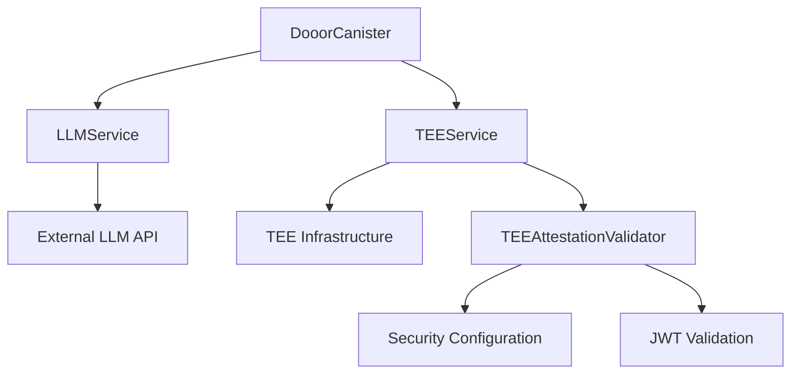

# Azle Hello World

- [Installation](#installation)
- [Deployment](#deployment)
- [Testing](#testing)

Azle helps you to build secure decentralized/replicated servers in TypeScript or JavaScript on [ICP](https://internetcomputer.org/). The current replication factor is [13-40 times](https://dashboard.internetcomputer.org/subnets).

Azle stable mode is continuously subjected to [intense scrutiny and testing](https://github.com/demergent-labs/azle/actions), however it has not yet undergone intense security review.

## Stable Mode

Azle runs in stable mode by default.

This mode is intended for production use after Azle's imminent 1.0 release. Its focus is on API and runtime stability, security, performance, TypeScript and JavaScript language support, the ICP APIs, and Candid remote procedure calls (RPC). There is minimal support for the Node.js standard library, npm ecosystem, and HTTP server functionality.

## Installation

> Windows is only supported through a Linux virtual environment of some kind, such as [WSL](https://learn.microsoft.com/en-us/windows/wsl/install)

You will need [Node.js](#nodejs) and [dfx](#dfx) to develop ICP applications with Azle:

### Node.js

It's recommended to use nvm to install the latest LTS version of Node.js:

```bash
curl -o- https://raw.githubusercontent.com/nvm-sh/nvm/v0.40.3/install.sh | bash
```

Restart your terminal and then run:

```bash
nvm install --lts
```

Check that the installation went smoothly by looking for clean output from the following command:

```bash
node --version
```

### dfx

Install the dfx command line tools for managing ICP applications:

```bash
DFX_VERSION=0.27.0 sh -ci "$(curl -fsSL https://internetcomputer.org/install.sh)"
```

Check that the installation went smoothly by looking for clean output from the following command:

```bash
dfx --version
```

## Deployment

To create and deploy a simple sample application called `hello_world`:

```bash
# create a new default project called hello_world
npx azle new hello_world
cd hello_world
```

```bash
# install all npm dependencies including azle
npm install
```

```bash
# start up a local ICP replica
dfx start --clean
```

In a separate terminal in the `hello_world` directory:

```bash
# deploy your canister
dfx deploy
```

## Testing

If you would like to run the included test suite:

```bash
# start up a local ICP replica
dfx start --clean
```

In a separate terminal in the `hello_world` directory:

```bash
npm test
```

# Dooor ICP Canister

A comprehensive Internet Computer Protocol (ICP) canister providing Large Language Model (LLM) management and Trusted Execution Environment (TEE) validation services.

## 🚀 Overview

The Dooor ICP Canister is a robust smart contract deployed on the Internet Computer blockchain that provides:

- **LLM Service Management**: Complete CRUD operations for Large Language Model configurations
- **TEE Infrastructure Validation**: Comprehensive security validation for Trusted Execution Environments
- **Secure HTTP Outcalls**: Standardized external API communication with proper error handling
- **Professional Architecture**: Clean code structure following enterprise-grade development standards

## 📋 Features

### Large Language Model (LLM) Services
- **Model Discovery**: Retrieve all available LLM models with metadata
- **Model Details**: Get specific model information by unique identifier
- **Default Configuration**: Set and manage default model configurations

### Trusted Execution Environment (TEE) Services
- **Infrastructure Validation**: Complete end-to-end TEE security assessment
- **Attestation Verification**: JWT-based attestation token validation
- **Security Configuration**: Firewall and security policy verification
- **Compliance Reporting**: Detailed security compliance reports

## 🔧 Technical Architecture

### Core Components

```
├── src/
│   ├── index.ts              # Main canister class and endpoint definitions
│   ├── llmEndpoints.ts       # LLM service implementation
│   ├── teeEndpoints.ts       # TEE validation service implementation
│   ├── config.ts             # Configuration constants and settings
│   ├── constants.ts          # Application constants and error codes
│   ├── types.ts              # TypeScript interfaces and type definitions
│   └── tee-validation/       # TEE validation logic and types
│       ├── tee-validator.ts  # Core TEE validation implementation
│       └── types.ts          # TEE-specific type definitions
```

### Service Architecture



## 📚 API Documentation

### LLM Endpoints

#### Get All Models
```typescript
@query([], IDL.Text)
async getAllModels(): Promise<string>
```
**Description**: Retrieves all available LLM models  
**Returns**: JSON string containing list of models with metadata  
**HTTP Method**: GET  

#### Get Model by ID
```typescript
@query([IDL.Text], IDL.Text)
async getModelById(modelId: string): Promise<string>
```
**Description**: Retrieves specific model information by ID  
**Parameters**: 
- `modelId`: Unique identifier of the model  
**Returns**: JSON string containing model details  
**HTTP Method**: GET  

#### Set Default Model
```typescript
@update([IDL.Text], IDL.Text)
async setDefaultModel(modelId: string): Promise<string>
```
**Description**: Sets a specific model as the system default  
**Parameters**: 
- `modelId`: Unique identifier of the model to set as default  
**Returns**: JSON string containing operation result  
**HTTP Method**: POST  

### TEE Endpoints

#### Validate TEE Infrastructure
```typescript
@update([], IDL.Text)
async validateTeeInfrastructure(): Promise<string>
```
**Description**: Performs complete TEE infrastructure validation  
**Returns**: JSON string containing comprehensive security report  
**HTTP Method**: POST  

**Response Structure**:
```json
{
  "timestamp": "2024-01-01T00:00:00.000Z",
  "validation_status": "PASSED" | "FAILED" | "ERROR",
  "infrastructure_summary": {
    "trusted": boolean,
    "hardware": string,
    "project": string,
    "instance": string,
    "zone": string,
    "tee_authentic": boolean,
    "firewall_secure": boolean,
    "overall_trusted": boolean
  },
  "security_assessment": {
    "jwt_validation": {
      "valid": boolean,
      "errors": string[]
    },
    "security_validation": {
      "valid": boolean,
      "errors": string[],
      "warnings": string[]
    }
  },
  "compliance_report": {
    "tee_authentic": boolean,
    "firewall_secure": boolean,
    "overall_trusted": boolean
  }
}
```

## 🛠️ Setup and Deployment

### Prerequisites
- Node.js (v18+)
- DFX (Internet Computer SDK)
- TypeScript

### Installation
```bash
# Clone the repository
git clone <repository-url>
cd dooor-cannister-icp

# Install dependencies
npm install

# Start local Internet Computer replica
dfx start --background

# Deploy the canister
dfx deploy
```

### Configuration

Update `src/config.ts` with your specific endpoints:

```typescript
export const URLS = {
    TEE_SECURITY: 'https://your-tee-api.domain.com/v1/tee/security-config',
    TEE_CONNECT: 'https://your-tee-api.domain.com/v1/tee/connect',
    LLM_MODELS: 'http://your-llm-api.domain.com/v1/api/icp/llm-models',
    LLM_MODEL_BY_ID: 'http://your-llm-api.domain.com/v1/api/icp/llm-models',
    LLM_SET_DEFAULT: 'http://your-llm-api.domain.com/v1/api/icp/llm-models/default'
};
```

## 📖 Usage Examples

### JavaScript/TypeScript Client

```typescript
import { Actor, HttpAgent } from '@dfinity/agent';
import { idlFactory } from './declarations/dooor_canister';

// Initialize the actor
const agent = new HttpAgent();
const canister = Actor.createActor(idlFactory, {
  agent,
  canisterId: 'your-canister-id'
});

// Get all LLM models
const models = await canister.getAllModels();
console.log('Available models:', JSON.parse(models));

// Validate TEE infrastructure
const teeReport = await canister.validateTeeInfrastructure();
console.log('TEE Validation:', JSON.parse(teeReport));
```

### CLI Usage

```bash
# Get all models
dfx canister call dooor_canister getAllModels

# Get specific model
dfx canister call dooor_canister getModelById '("model-id-123")'

# Set default model
dfx canister call dooor_canister setDefaultModel '("model-id-456")'

# Validate TEE infrastructure
dfx canister call dooor_canister validateTeeInfrastructure
```

## 🔒 Security Features

- **TEE Attestation**: JWT-based attestation verification
- **Firewall Validation**: Security configuration verification
- **Error Handling**: Comprehensive error handling and logging
- **Type Safety**: Full TypeScript implementation with strict typing
- **Input Validation**: Parameter validation and sanitization

## 📊 Monitoring and Logging

The canister includes strategic logging for:
- TEE validation results
- HTTP request failures
- Security assessment outcomes
- Error tracking and debugging

## 🤝 Contributing

Please follow the established coding standards:
- Clean code principles with Single Responsibility Principle
- Comprehensive documentation for all methods
- TypeScript strict mode compliance
- Professional error handling

## 📄 License

[License information - specify your license]

## 🆘 Support

For support and questions:
- [Your support channel]
- [Documentation link]
- [Issue tracker]

---

**Built with ❤️ for the Internet Computer ecosystem**
